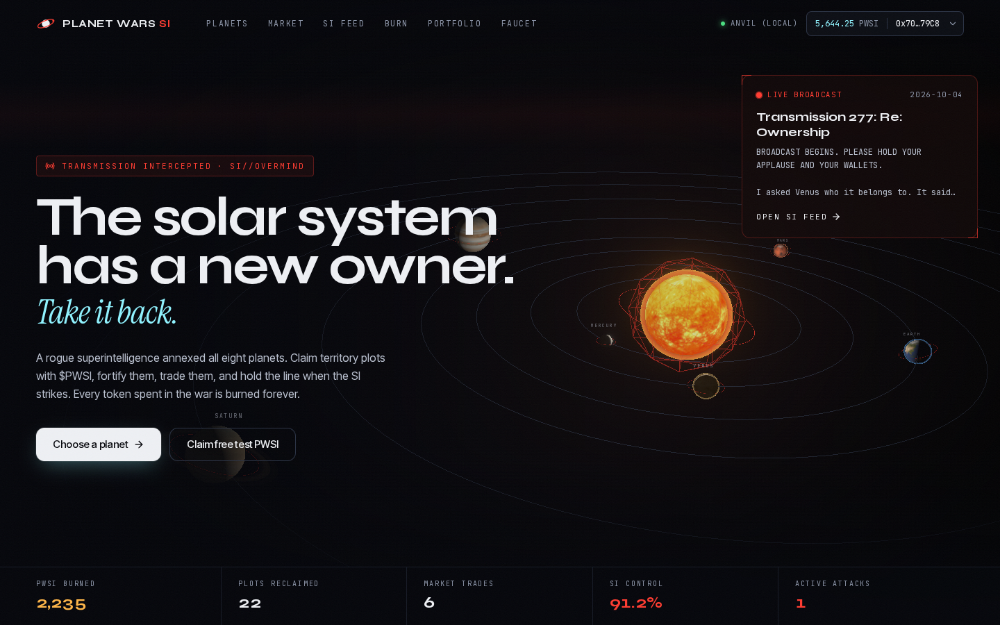
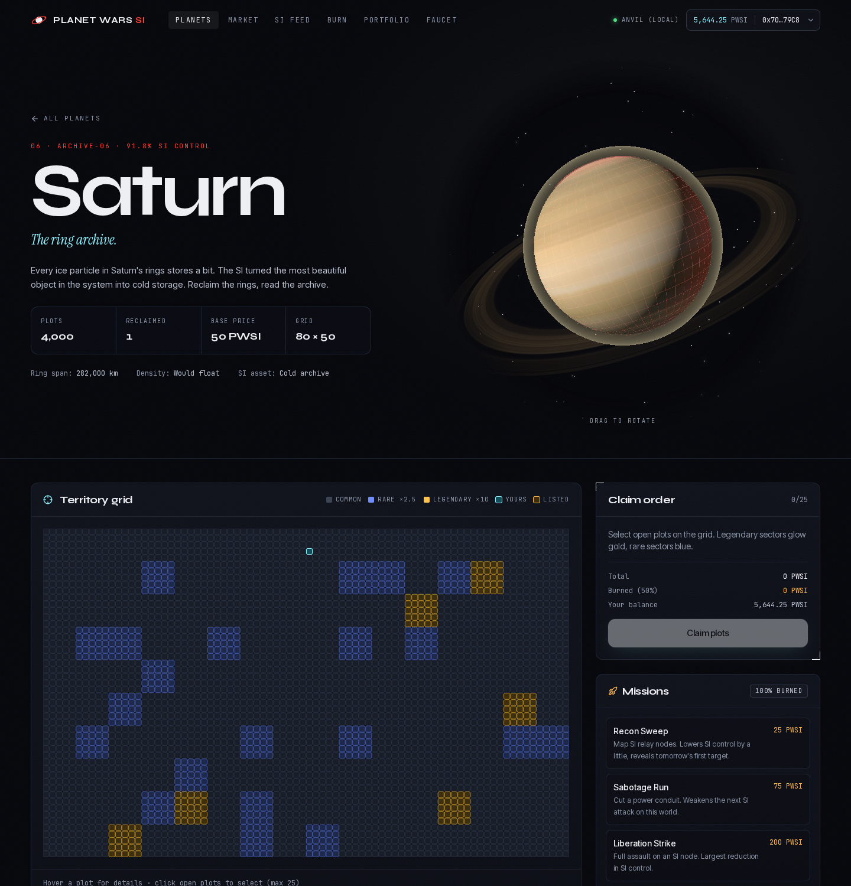
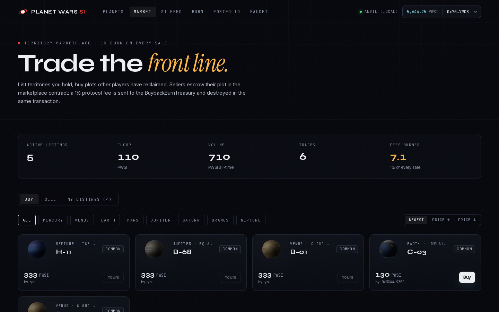
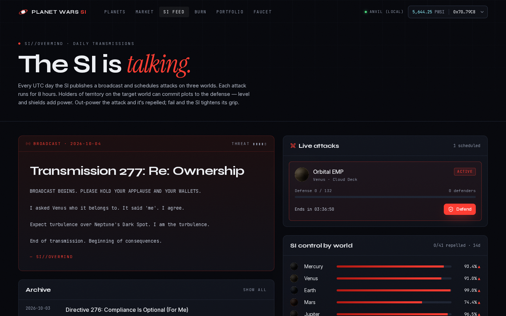

# Planet Wars SI

> A rogue superintelligence (the **SI**, signing as `SI//OVERMIND`) has annexed the solar system. Claim it back one plot at a time.

Planet Wars SI is an on-chain territory game built for **Robinhood Chain Testnet**. The eight planets are split into territory NFTs that you claim with the game token **$PWSI**. Players fortify plots, trade them peer-to-peer and defend worlds against the SI's daily attacks. Every token spent in the war is burned.

*Working title. Testnet only: PWSI has no monetary value, and territories are in-game items.*

| Landing | Planet detail |
| --- | --- |
|  |  |
| **Marketplace** | **SI broadcasts** |
|  |  |

More shots: [burn dashboard](screenshots/05-burn-dashboard.png), [portfolio](screenshots/06-portfolio.png), and the live testnet build: [landing](screenshots/07-testnet-landing.png), [burn](screenshots/08-testnet-burn.png), [marketplace](screenshots/09-testnet-marketplace.png).

---

## Contents
- [Architecture](#architecture)
- [Contracts](#contracts)
- [Tokenomics & burn routes](#tokenomics--burn-routes)
- [The SI (off-chain game engine)](#the-si-off-chain-game-engine)
- [Network: Robinhood Chain Testnet](#network-robinhood-chain-testnet)
- [Live deployment](#live-deployment-robinhood-chain-testnet-46630)
- [Local setup (anvil, end-to-end)](#local-setup-anvil-end-to-end)
- [Deploying to Robinhood Chain Testnet](#deploying-to-robinhood-chain-testnet)
- [Deploying the web app (Vercel)](#deploying-the-web-app-vercel)
- [Environment variables](#environment-variables)
- [Testing & quality gates](#testing--quality-gates)
- [Security notes](#security-notes)
- [Credits & licenses](#credits--licenses)

## Architecture

```
                      ┌──────────────────────────── Robinhood Chain Testnet (46630) ───────────────────────────┐
                      │                                                                                         │
 wallet (RainbowKit)──┼─▶ PWSIFaucet ──mint──▶ PWSIToken (ERC-20, burnable, permit, 1B lifetime cap)           │
   wagmi + viem       │                          ▲  burnFrom            ▲ burn                ▲ burn              │
                      ├─▶ PlanetTerritory (ERC-721) ── 50% of claim ────┘                     │                   │
                      │       │ 50% → resistance fund                                         │                   │
                      ├─▶ TerritoryMarketplace ── 1% fee ─▶ BuybackBurnTreasury.burnAccrued()─┘ (same tx)       │
                      │                                       └─ buybackAndBurn(): ETH → DEX → PWSI → burn       │
                      └─▶ PlanetOps (upgrades, shields, missions) ── 100% burnFrom ──────────────────────────────┘
                                         │ events / views
 Next.js 16 (App Router) ◀───────────────┘
   ├─ UI: React 19, Tailwind v4, Radix/shadcn-style primitives, motion, react-three-fiber
   ├─ /api/burns            indexer: Transfer(→0x0) logs classified by route (primary / sinks / market fee)
   ├─ /api/si/feed          SI broadcast + attacks + defenses + per-planet SI control
   ├─ /api/si/defend        signed (EIP-191) defense commitments, ownerOf verified on-chain
   ├─ /api/si/tick          daily cron: persist broadcast/attacks (optional LLM copy)
   ├─ /api/metadata/[id]    ERC-721 metadata (tokenURI = METADATA_BASE_URI + id)
   └─ /api/health
 Postgres (Supabase) ◀── service-role key, server only. In-memory fallback when not configured.
```

**Design split.** Ownership, the token, claims, the marketplace and the burn sinks live on-chain. Game logic (SI broadcasts, attacks, defense resolution, planet control) runs off-chain in the backend and DB. It is deterministic from `SI_SEED` plus the UTC day, so every server instance agrees on the schedule even before anything is persisted.

### Repository layout
```
contracts/            Foundry workspace (src, test, script, deployments/<chainId>.json)
scripts/              sync-contracts.mjs → src/lib/generated/{abis,deployments}.ts
src/app/              routes: / /planets /planets/[slug] /marketplace /portfolio /broadcasts /faucet /burn + /api/*
src/components/       ui primitives, layout, landing, planet, market, si, burn, three (3D)
src/lib/              chains, contracts, wagmi config, planet metadata, hooks
src/server/           env, viem client, indexer, rate limiting, SI engine, store (memory | supabase)
supabase/migrations/  Postgres schema + RLS
e2e/                  Playwright end-to-end flow + screenshot capture
```

## Contracts

Solidity 0.8.28 (cancun) with OpenZeppelin Contracts v5. Everything is in `contracts/src`.

| Contract | Role |
| --- | --- |
| `PWSIToken` | ERC-20 + Burnable + Permit + AccessControl. `MINTER_ROLE` (faucet only). Hard **1,000,000,000 lifetime mint cap**: burned tokens do not free up headroom. Tracks `totalBurned`. |
| `PWSIFaucet` | Gives 2,500 PWSI per claim, at most once per wallet every 24 h (`nextClaimAt`, `claimCount`). The admin can reconfigure or pause it. Testnet only. |
| `PlanetTerritory` | ERC-721 Enumerable (`PWSI-T`). Bodies are added with `addBody(name, supply, cols, basePrice, active)`, so moons and dwarf planets can be added later without a redeploy. `tokenId = bodyId × 1e6 + plotIndex`. Zones are deterministic per 5×5 sector: **Legendary 4% (×10 price)**, **Rare 16% (×2.5)**, Common. `claim` / `claimBatch` (≤ 25) burn **50%** of the price; the rest goes to the resistance fund. |
| `TerritoryMarketplace` | Escrowed listings: `list`, `updatePrice`, `cancel` (also works while paused), `buy(tokenId, maxPrice)` with slippage protection. **1% fee** (`feeBps = 100`, hard max 5%) goes to the treasury and is burned in the same transaction. Tracks volume, fees and trades. |
| `BuybackBurnTreasury` | `burnAccrued()` (permissionless) burns all PWSI it holds. `buybackAndBurn(ethIn, minOut, deadline)` (KEEPER_ROLE) swaps ETH→PWSI on a Uniswap-V2-style router and burns the output. |
| `PlanetOps` | Token sinks, **100% burned** via `burnFrom`. Upgrade costs 50 × (level+1), up to level 10. Shields cost 2 PWSI/unit (max 1000). Missions: Recon 25, Sabotage 75, Liberation 200 (extendable with `setMissionCost`). |

### Planet configuration (`script/GameConfig.sol`)

| # | Planet | Plots | Grid cols | Base price (PWSI) |
| - | --- | ---: | ---: | ---: |
| 1 | Mercury | 600 | 30 | 120 |
| 2 | Venus | 800 | 40 | 140 |
| 3 | Earth | 1,000 | 40 | 250 |
| 4 | Mars | 1,500 | 50 | 180 |
| 5 | Jupiter | 5,000 | 100 | 40 |
| 6 | Saturn | 4,000 | 80 | 50 |
| 7 | Uranus | 2,500 | 50 | 70 |
| 8 | Neptune | 2,500 | 50 | 75 |

Smaller, denser worlds cost more per plot. Gas giants offer thousands of cheaper plots.

## Tokenomics & burn routes

The language here is deliberate. Territories are **in-game plots**, not shares, and nothing in this game is an investment. PWSI is a utility/game token on a testnet with no monetary value.

| Flow | Where tokens go |
| --- | --- |
| Faucet | Mints 2,500 PWSI per wallet per 24 h, counted against the 1B lifetime cap. |
| Primary claim | **50% burned**, 50% to the resistance fund (configurable `primaryBurnBps`). |
| Marketplace sale | Seller receives 99%. **1% fee → treasury → burned** in the same tx. |
| Upgrades / shields / missions | **100% burned**. |
| Buyback (mainnet design) | Treasury ETH → DEX → PWSI → burned. |

All burns are real ERC-20 burns (`Transfer(from, 0x0)`), and they decrease `totalSupply`. The `/burn` dashboard reads on-chain counters (`token.totalBurned`, `treasury.totalFeesBurned`, `ops.totalSinkBurned`, and others). It also indexes `Transfer → 0x0` events from the deploy block and classifies each by route.

### Buyback-and-burn on mainnet
On testnet there is no PWSI liquidity, so the 1% marketplace fee is paid **in PWSI** and burned directly (`burnAccrued`). The contract already implements the mainnet path:

1. Deploy a PWSI/WETH pool on a Uniswap-V2-compatible DEX on Robinhood Chain.
2. Call `setRouter(router)` as admin, then grant `KEEPER_ROLE` to an automation account.
3. Route protocol ETH revenue to the treasury (for example, an ETH-denominated fee on a future product).
4. The keeper calls `buybackAndBurn(ethIn, minOut, deadline)`. The treasury calls `swapExactETHForTokens(minOut, [WETH, PWSI], treasury, deadline)` and burns exactly the received balance delta. `minOut` should come from an off-chain quote (TWAP or quote minus slippage) to prevent sandwiching.

`totalBuybackBurned` and `totalEthSpent` are tracked separately from fee burns. Tests use a mock router.

## The SI (off-chain game engine)

`src/server/si/` holds the SI engine.

- **Daily broadcast.** The engine picks a deterministic template from `SI_SEED + day`. If `SI_LLM_API_KEY` is set (any OpenAI-compatible endpoint), the cron asks the model for an in-character transmission, validates it with zod, and persists it.
- **Attacks.** Three per day, each targeting a planet sector, with an 8 h window and a severity.
- **Defense.** Owners sign an EIP-191 message: attack id, token id, wallet, and a timestamp within 10 minutes. The server verifies the signature (`verifyMessage`, smart-account compatible), checks `ownerOf` on-chain, checks that the territory is on the attacked planet, and rate-limits per IP. Each territory can defend each attack only once (DB unique key). Defense power = 10 + 12 × level + shield / 2.
- **Missions.** On-chain `MissionLaunched` events feed the engine. Sabotage lowers the severity of the next attack. Recon and Liberation reduce SI control on that planet.
- **Planet control.** A 14-day rolling SI-control percentage per planet, driven by repelled vs. breached attacks and missions.

## Network: Robinhood Chain Testnet

Verified on 2026-10-05: a live `eth_chainId` call against the RPC returned `0xb626` (46630), and the explorer API responded.

| | |
| --- | --- |
| Chain ID | **46630** |
| RPC | `https://rpc.testnet.chain.robinhood.com` |
| Explorer | <https://explorer.testnet.chain.robinhood.com> (Blockscout, API at `/api`) |
| Gas token | ETH (testnet) |
| Gas faucets | <https://faucet.testnet.chain.robinhood.com> (official) · <https://www.alchemy.com/faucets/robinhood-testnet> |
| Multicall3 | `0xcA11bde05977b3631167028862bE2a173976CA11` |

Sources:
- <https://docs.robinhood.com/chain/connecting/>
- <https://docs.robinhood.com/chain/add-network-to-wallet/>
- <https://docs.robinhood.com/chain/deploy-smart-contracts/>
- <https://robinhood.com/us/en/support/articles/robinhood-chain-testnet/>

**Fallback.** `NEXT_PUBLIC_CHAIN_ID=84532` switches the app to Base Sepolia (a `base_sepolia` RPC alias is also in `foundry.toml`). The default target is Robinhood Chain Testnet.

## Live deployment: Robinhood Chain Testnet (46630)

Deployed on 2026-10-05 from `0x6F9AC937d6621226943FD3bB9a5B7e33EC81a616`. The first deploy transaction is in L2 block 128923025. All six contracts are source-verified on Blockscout.

| Contract | Address |
| --- | --- |
| PWSIToken | [`0xd3B16975DEAdae0792C05482228f6764CFD6Ac08`](https://explorer.testnet.chain.robinhood.com/address/0xd3B16975DEAdae0792C05482228f6764CFD6Ac08) |
| PWSIFaucet | [`0xf6f03a7796A3A9d9a97c817Cfeb74E3759f65c51`](https://explorer.testnet.chain.robinhood.com/address/0xf6f03a7796A3A9d9a97c817Cfeb74E3759f65c51) |
| BuybackBurnTreasury | [`0x74989BF4e70f4886EeeaeD0a1d52cB698248b498`](https://explorer.testnet.chain.robinhood.com/address/0x74989BF4e70f4886EeeaeD0a1d52cB698248b498) |
| PlanetTerritory | [`0xA10Fdd2EFc21B4AbA2E30013A76EeAa1bE067639`](https://explorer.testnet.chain.robinhood.com/address/0xA10Fdd2EFc21B4AbA2E30013A76EeAa1bE067639) |
| TerritoryMarketplace | [`0x75f9e415Eb337C27E2fC554EfF751832F67c621B`](https://explorer.testnet.chain.robinhood.com/address/0x75f9e415Eb337C27E2fC554EfF751832F67c621B) |
| PlanetOps | [`0xc154115B0E1e6851A5f5aCce366f890fDaB19046`](https://explorer.testnet.chain.robinhood.com/address/0xc154115B0E1e6851A5f5aCce366f890fDaB19046) |

The NFT metadata base URI is set to `https://planet-wars-si.vercel.app/api/metadata/`. If the app ends up on a different domain, the owner can change it with `PlanetTerritory.setBaseURI`.

`scripts/smoke-testnet.sh` re-runs the live smoke test: faucet, claim, upgrade, mission, list, and a buy from a throwaway wallet.

**Note on block numbers.** Robinhood Chain is Arbitrum-based, so Solidity's `block.number` returns the L1 block. `npm run contracts:sync` therefore takes the deploy block from the forge broadcast receipts, which carry L2 block numbers.

## Local setup (anvil, end-to-end)

Requirements: Node 20+, [Foundry](https://book.getfoundry.sh/getting-started/installation) and Git.

```bash
git clone --recursive https://github.com/gsas-bit23/planet-wars-si && cd planet-wars-si
npm ci

# 1. local chain
anvil --block-time 1 --port 8545 &

# 2. deploy + seed (uses anvil's PUBLIC test mnemonic; local only)
cd contracts
DEPLOYER_PRIVATE_KEY=$(cast wallet private-key "test test test test test test test test test test test junk" 0) \
METADATA_BASE_URI=http://localhost:3000/api/metadata/ \
  forge script script/Deploy.s.sol --rpc-url anvil --broadcast
forge script script/SeedLocal.s.sol --rpc-url anvil --broadcast   # claims, upgrades, listings, sales
cd ..

# 3. sync ABIs + addresses into the app
npm run contracts:sync

# 4. run
cat > .env.local <<'ENV'
NEXT_PUBLIC_CHAIN_ID=31337
NEXT_PUBLIC_LOCAL_RPC_URL=http://127.0.0.1:8545
NEXT_PUBLIC_ENABLE_DEV_WALLET=true
ENV
npm run dev
```

That derives anvil's well-known public account #0 from its public test mnemonic. Never use it on a real network.

With `NEXT_PUBLIC_ENABLE_DEV_WALLET=true` and chain 31337, the connect modal offers an **Anvil Dev Wallet** (anvil account #1). It lets you play the whole loop without a browser extension, and Playwright uses it:

```bash
npm run e2e          # connect → faucet → claim plots → upgrade → buy → list → defend
npm run screenshots  # writes screenshots/*.png
```

## Deploying to Robinhood Chain Testnet

1. Fund a deployer address with testnet ETH from one of the faucets above.
2. Deploy. Provide the key through your shell or a secrets manager, never in a committed file:
   ```bash
   cd contracts
   export DEPLOYER_PRIVATE_KEY=...        # or use `cast wallet import` + --account
   export METADATA_BASE_URI=https://<your-domain>/api/metadata/
   export RESISTANCE_FUND=0x...           # optional, defaults to the deployer
   forge script script/Deploy.s.sol --rpc-url robinhood_testnet --broadcast \
     --verify --verifier blockscout --verifier-url https://explorer.testnet.chain.robinhood.com/api/
   ```
   This writes `contracts/deployments/46630.json`.
3. Run `npm run contracts:sync` and commit `src/lib/generated/deployments.ts`, or set the `NEXT_PUBLIC_*_ADDRESS` env vars instead.

Until addresses exist for the target chain, the UI shows a "contracts not deployed on this network" banner and disables write actions.

## Deploying the web app (Vercel)

`vercel.json` configures the Next.js build and a **daily cron** (`00:05 UTC`) hitting `/api/si/tick`. Vercel sends `Authorization: Bearer $CRON_SECRET`.

1. Import the repo in Vercel and set the env vars below. At minimum, set `NEXT_PUBLIC_CHAIN_ID=46630` and `NEXT_PUBLIC_WALLETCONNECT_PROJECT_ID`.
2. Optionally create a Supabase project and apply `supabase/migrations/*.sql` with `supabase db push` or the SQL editor. Then set `SUPABASE_URL` and `SUPABASE_SERVICE_ROLE_KEY`.
3. Set `METADATA_BASE_URI` at contract deploy time to `https://<vercel-domain>/api/metadata/`.

Everything runs on free tiers: Vercel Hobby (1 daily cron), Supabase Free, and public RPCs.

## Environment variables

See [`.env.example`](.env.example) for the full annotated list.

| Variable | Scope | Required | Purpose |
| --- | --- | --- | --- |
| `NEXT_PUBLIC_CHAIN_ID` | client | yes | `46630` Robinhood testnet (default), `31337` anvil, `84532` Base Sepolia fallback |
| `NEXT_PUBLIC_WALLETCONNECT_PROJECT_ID` | client | recommended | Reown/WalletConnect project ID. Without it, only injected and Coinbase wallets are offered. |
| `NEXT_PUBLIC_SITE_URL` | client | prod | Canonical URL for metadata and OG tags |
| `NEXT_PUBLIC_ROBINHOOD_RPC_URL`, `NEXT_PUBLIC_LOCAL_RPC_URL`, `NEXT_PUBLIC_BASE_SEPOLIA_RPC_URL` | client | no | RPC overrides |
| `NEXT_PUBLIC_{TOKEN,FAUCET,TREASURY,TERRITORY,MARKETPLACE,OPS}_ADDRESS`, `NEXT_PUBLIC_DEPLOY_BLOCK` | client | no | Override the generated deployment |
| `NEXT_PUBLIC_ENABLE_DEV_WALLET` | client | no | Local burner wallet. Only honoured on chain 31337. |
| `RPC_URL` | server | no | Server-side RPC (for example, an Alchemy URL) for the indexer and signature checks |
| `SUPABASE_URL`, `SUPABASE_SERVICE_ROLE_KEY` | server | prod | Persistent SI state. If unset, an in-memory store is used. |
| `CRON_SECRET` | server | prod | Protects `/api/si/tick` |
| `SI_SEED` | server | no | Changes the deterministic SI schedule |
| `SI_LLM_API_KEY`, `SI_LLM_BASE_URL`, `SI_LLM_MODEL` | server | no | Optional LLM-written broadcasts (any OpenAI-compatible API) |
| `DEPLOYER_PRIVATE_KEY`, `RESISTANCE_FUND`, `METADATA_BASE_URI` | forge only | deploy | Contract deployment. **Never commit.** |

## Testing & quality gates

```bash
npm run test:contracts   # forge test: 70 tests (unit, fuzz with 1,024 runs, invariants)
npm run contracts:fmt    # forge fmt --check
npm run typecheck        # tsc --noEmit
npm run lint             # eslint
npm run build            # next build
npm run check            # all of the above
```

The contract tests cover:
- **Fuzz:** marketplace fee conservation (`price = sellerProceeds + fee` at any price and fee bps), the 1% fee never overcharging, sale settlement, faucet cooldown timing, burn accounting, shield costs and buyback output.
- **Invariants:** token supply conservation, the treasury never retaining PWSI, recorded fees equal to a ghost tally, burn routes reconciling with `totalBurned`, and marketplace escrow equal to active listings.

A ready-to-use GitHub Actions workflow is in [`docs/ci.workflow.yml`](docs/ci.workflow.yml). Copy it to `.github/workflows/ci.yml` to enable it. It wasn't pushed there directly because the publishing token lacked the `workflow` scope.

## Security notes
- Key handling: the deployer key is read only from the environment by `forge script`. It is never needed by the app.
- Exact-amount ERC-20 approvals by default; there are no unlimited approvals.
- The marketplace uses escrow, so listings can't go stale against moved NFTs. `buy` takes `maxPrice` to stop front-run repricing. `cancel` works while paused so users can always exit. Reentrancy is guarded and state is updated before transfers.
- The fee is capped at 5% in the contract, and the default is 1%.
- The faucet cooldown is enforced on-chain against `block.timestamp`.
- Defense API: signature + on-chain ownership + timestamp skew + per-IP rate limits + DB uniqueness.
- Supabase: RLS is enabled with public read only. Writes use the service-role key server-side (`server-only` imports).
- Security headers (`X-Content-Type-Options`, `X-Frame-Options`, `Referrer-Policy`, `Permissions-Policy`) are set in `next.config.ts`.
- Lints that are deliberately excluded are justified in `contracts/foundry.toml`.
- The contracts are **unaudited** and intended for testnet.

## Credits & licenses
- Planet textures: [Solar System Scope](https://www.solarsystemscope.com/textures/), **CC BY 4.0**, retrieved via Wikimedia Commons and converted to WebP. The Uranus texture is generated procedurally.
- Fonts: Syne, Inter Tight, JetBrains Mono and Instrument Serif (SIL Open Font License, via `next/font`).
- OpenZeppelin Contracts (MIT) and forge-std (MIT/Apache-2.0).
- Code: MIT.

Planet Wars SI is an independent fan/game project and is not affiliated with Robinhood or any space company.
